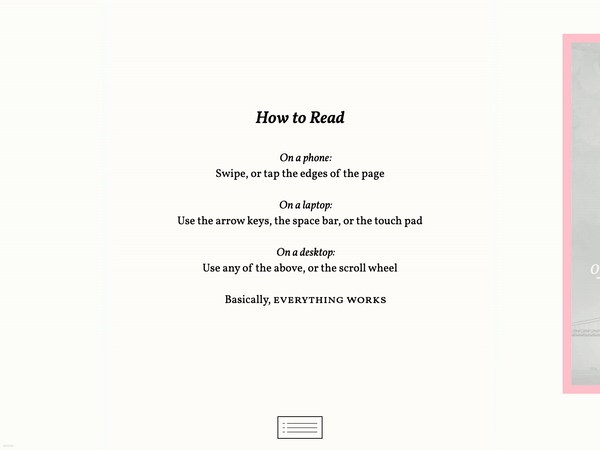

# Perfect Edition

is an aspirational name for this project, which aims to provide a lean, fast-loading web e-book template with a kind of definitive sturdiness. (I first encountered the term "perfect edition" in the world of manga. I haven't been able to confirm this etymology, but I think it comes from the use of a perfect paperback binding.)



You can see a live, current-ish demo of the template [here](https://robinsloan.github.io/perfect-edition/build/web/index.html).

## What it is

* a web e-book template that works in modern browsers
* a tool to generate a nice web edition and robust EPUB edition from the same text
* suitable for fiction and other straight-through prose

## What it's not

* a content management system
* a plugin for larger frameworks
* suitable for complex layouts and "textbook-like" projects

## Goals and principles

I started designing and coding this template because I wasn't satisfied with the other options I found, all of which seemed to offer either too little or too much for my purposes. ([I am a fiction writer.](https://www.robinsloan.com/books/))

I imagined a web e-book that was *paged*, *selectable*, *lightweight*, and *typographically perfect*.

**Paged:** This is 100% my opinion, but I believe the side-to-side paged experience communicates something important about what you're reading, and maybe why you're reading it. That's probably not intrinsic; instead, it has to do with all the associations built up over time, the feelings it triggers. I think those things are important! This, for me, was non-negotiable.

**Selectable:** In a browser, a reader should always be free to search for, select, and copy text anywhere in the book, all using the browser's native tools.

**Lightweight:** I mean that both in terms of (1) the e-book's underlying code, so it's possible for one person to "hold it all in their head," and (2) its performance in the browser. It should load instantly and respond without any lag, ever.

**Typographically perfect:** It's amazing what CSS can do these days! A web e-book should at least *aspire* to typesetting on the level of the best print books.

In addition, there's one important "non-goal," which is support for legacy browsers or, indeed, any browsers that don't offer new-ish CSS functions like `calc()` and `clamp()`. This choice is what made it possible for me to contemplate building this at all, and I am sticking to it in the project's public phase.

## Thanks

This project was made possible by 1022 patrons who supported the release of my novella *Annabel Scheme and the Adventure of the New Golden Gate*. The [lo-fi crowdfunding campaign](https://www.robinsloan.com/sloanstarter/) ran for just one week; after it reached its goal, [the novella's web edition](https://www.robinsloan.com/books/annabel-scheme-serial) along with the code underpinning it---this project---became public goods. Thank you, patrons!

## How to work with this template

You need a computer with Ruby 2.6 or above and a modern browser.

This project uses a `source` directory and a `build` directory. The `source` directory contains both the e-book template and the e-book text, which is stored in Markdown format.

In the Markdown text, chapters are marked with `h2` tags and full-page "intertitles" are `h1`s. There is no special styling for blockquotes, lists, or really anything other than paragraph text. This will improve over time---maybe with your help!

After you clone the project, `cd` into the directory and run:

```
bundle install
ruby serve.rb
```

That will

1. combine the text with the template to generate a finished e-book in a new `build` directory, and
2. serve that finished e-book, which you can view at `http://localhost:8000/`.

(The script also generates an EPUB edition, which really isn't the focus of this project, but a feature I needed, so there you go!)

To swap out the text, provide your own Markdown file and then edit `book.yaml`. The values there are mostly self-explanatory, and those that aren't probably need to be dropped or replaced.

The `serve.rb` script watches the entire `source` directory and, whenever you make a change, regenerates the e-book.

If you'd like to generate the e-book without starting a web server, you can just run `ruby generate.rb`.

**I think it's important to say:** It is my expectation that this template will be most useful to others not as-is, but instead as a starting point for specific, bespoke designs. Print books look different; that's what makes them great. I think web e-books should look different, too. So, even though I've been calling this a template, I hope it works more as a springboard, or even just a source of code snippets.

## Work to be done

I'm pleased with what I have here so far, but it's still a long way away from being any kind of "perfect edition." I'm going to keep working on it regularly for at least the next few months. Here's what's on my to-do list:

~~**Make it work in Firefox.** Currently, this template does not work at all in Firefox; currently, I have no idea why.~~ Note: This actually works better in Firefox than I realized. I unwittingly had a decrepit version installed 😅

**Make it work for other languages.** My development of this template has been, so far, painfully parochial, limited to the English-language text of my own novella. I want to engineer support for (and provide demo documents in) first non-English left-to-right scripts, and eventually right-to-left scripts, too. I am deeply afraid of the things this will reveal about the brittleness of the code 😬

**Rationalize the CSS.** The current styling isn't completely horrible, but it has the clear signature of hasty accretion over time. I'd like to go back and organize the CSS using some clear principles so it's easier to read and understand.

**Add more basic styles.** Lists, blockquotes, etc.

**Improve the typesetting.** I said above that it is the aspiration of this project to be "typographically perfect." Currently it is "typographically competent, mostly," so there's a long way to go.

**Think about HTML vs. JavaScript.** Early versions of this template were breathtakingly minimal, a `<nav>` and a bunch of `<p>`s---it was great. Over time I added other important elements---the TOC display button, the bookmark---and I'm now wondering if they really belong in the HTML source or if I should create and append those elements in JavaScript. I like the idea of a minimal, logical HTML file; at the same time, I want everything to be available instantly. I'm going to look at the tradeoffs here.

## An invitation

If this investigation into lightness and long-form reading on the web is interesting to you, I invite you to join in! Your issues---bug reports and enhancement ideas alike---are warmly invited. Pull requests, too.

In particular, this project would benefit from some deep, clear thinking about CSS, so if that's your thing, whew, I could really use your help.

From Oakland,

Robin
