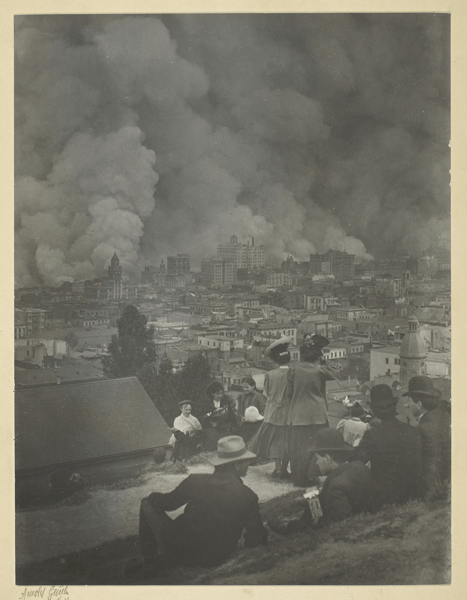

## Note to Readers

This story was initially published as a daily serial in two Bay Area newspapers, the *Mercury News* and *East Bay Times*, in 2020. It ran from June 7 to June 21. The whole thing was written in the two weeks prior: a stressful, exciting rush. All in all, it was one of the great surprises and delights of my writing career so far.

I wrote the story, but its true instigator was Jackie Burrell at the Bay Area News Group. Daily serialization was her idea, and her thoughtful edits are evident in every chapter. I'm grateful for her ingenuity and skill.

This story wears its origin on its sleeve. Initially, I had edited out each chapter's little introductory line, intended to reorient the daily newspaper reader to the action. Reading it straight through, they're repetitive and a bit "duh." But, after they were gone, I discovered that I missed them! Their dorky energy; the breathless, retro sense of "last week on *Annabel Scheme*!"

Part of the assignment I set for myself was to produce a work of *ridiculously regional fiction*. Jackie's invitation arrived in the early days of the pandemic, and there was something powerfully appealing about writing a story not only *about* but *for* this very specific place that is my home. To be honest, I do worry that this feature makes the story less accessible and/or interesting to readers with no knowledge of the Bay Area... but, there's only one way to find out! It goes without saying that I have stood in every spot and driven every road mentioned in these pages.

This adventure is neither sequel nor prequel to the <a href="https://www.robinsloan.com/annabel-scheme" target="_blank">original Annabel Scheme novella</a> published in 2009. It is instead... another possibility. Scheme fans will understand.

Robin Sloan 
Rotten City 
July 2020

# Week 1

## The Woman Who Vanished

<small>The burrito cannons blared at noon</small>, and into the sky above the city a fusillade of foil tubes went sailing: carnitas, carne asada, veggie supreme. They traced high glinting parabolas, hanging perfectly still at the apex, then accelerating earthward until their napkin-parachutes deployed. Pedestrians turned, arms outstretched. Cyclists pulled over; the moving catch, though tempting, was nearly impossible.

In the old days, you'd use the phone, call in your order like an artillery scout, shouting your cross streets and hoping for the best. But now the ordering and targeting is all done with software, the burritos guided by miniscule GPS chips. If you return one to the taqueria they give you a free agua fresca.

Every day, Stella Pajunas caught her lunch on the sidewalk in front of Alta Bay City Development headquarters. As the chief executive of the ABCD, she didn't have to catch it herself; she could have sent an underling scurrying to the sidewalk. But Stella Pajunas was smart. Her daily appearance marked her as a woman of the people.

On a sunny Tuesday in June, Stella Pajunas missed her burrito. This wouldn't have been a problem except that multiple pedestrian onlookers watched her step onto the sidewalk, reach upward, and vanish. Burrito, splat.

Dramatic enough way for a mystery to begin.

My name is Will Portacio. I have been an archivist, a librarian, and a Lyft driver. Until recently, I was the assistant to the Bay Area's greatest detective. I'm publishing this now because of what happened to Stella Pajunas, and the detective, and all of us.

Annabel Scheme kept an office in Rotten City. The locals love to call it that, insisting endlessly on their neighborhood's sinister character; in fact, it's utterly sweet, a mix of old houses and new condos, espresso bars and metalworking shops, all of it softened by trees: plum and palm and ginkgo.
Scheme's office occupied the top floor of a narrow brick building that also housed a rare book dealer, a biotech consultancy, and a website that reviewed electric bicycles. On the ground floor, there was a jam factory. I couldn't quite see the railroad tracks from my desk, but when the high-speed to Fresno shot past, it made a little sonic boom that rattled the windows.

Scheme had conducted investigations for the City of San Francisco and the Port of Oakland; for Google and Dragoman; for Chevron and Chez Panisse. Her specialty was the anomalous, the irrational. When something seemed like it must be a ghost, but surely it wasn't, you called Annabel Scheme.

It was only ever sometimes a ghost.

The ABCD was a steady client, thanks to its security chief, whose name was Arbusto Slab. It was Slab who stood now in Scheme's office, wide shouldered and wide hipped, impressively quadrilateral. It was Slab who had just described to us his boss's strange fate.

He squinted at me, jabbed a finger. "Who's the nerd?"

"I am the nerd," Scheme replied coolly. "My very hip partner is a respected analyst of the digital and the occult."

No one truly hip has ever been called hip, but I appreciated the gesture.

Arbusto Slab gazed at me and, whatever evaluation he made, he mentally crumpled it up and threw it in a wastebasket. He looked back at Scheme and, I suspect, never thought of me again.

"Well, anyway, she's been gone a whole day now, or near enough, and the board of directors... they are not calm people, Scheme. Not calm at all. It's a big operation, the ABCD. I really think---"

"I'll take the case," Scheme said. "We'll meet you on the bay."

Scheme's electric pickup was parked across the street. Today, the jam factory was simmering 300 pounds of seascape strawberries; the air was thick with them. One of the website's editors was pedaling a cargo bike up and down the block. Rotten City.

Scheme took us blasting south on Interstate 1080, windows down, her red curls whipping in the wind. The big cities of the bay flashed by on either side: busy Moletown, glittering San Leandro, Asparagus Flats with its high-rise greenhouses.

I wondered if Scheme had worked up any theories.

"Sure. Most likely explanation is, Stella Pajunas was never real to start with. Ectoplasmic projection. Mass hallucination, maybe."

Scheme was theorizing that the ABCD---really, the whole Bay Area---had been managed for ten years by a mass hallucination?

"It would explain some things, wouldn't it?"

We crossed into the sprawl of Peralta City. On the other side of 1080 was the Island of the Cats, which was neither an island nor home to any special concentration of cats.

Scheme was still theorizing. "It matters how she disappeared. If there was a flash of light, that's one thing. Smell of brimstone, totally different thing. I hope she didn't just vanish between frames."

Between frames?

"Here one millisecond, gone the next. The best explanation for that kind of phenomenon is that we're living in a computer simulation, and I am going to be *pissed* if we're living in a computer simulation."

Scheme's phone rang, warbling the theme to *Vertigo*.

"Slab," she said into the air. "We're on our way."

The security chief's voice rumbled in the pickup's speakers. "Yeah, well. She's back."

"Pajunas? How?"

"No idea, but she's screaming a lot." In the background, we heard a shriek. "Stuff about the bay. How they didn't fill it. I don't know. What did she just say, Lucy?" A voice replied. "Okay, yeah. She just said, it was all a mistake and now---yeah, she's crying. Anyway. I still think you should come."

Dramatic enough way for a mystery to begin.

Scheme pushed the pickup even faster, the whole boiling megacity of the bay a blur on either side of us, and I wondered where Stella Pajunas had been for the last twenty-four hours. What she'd seen.

"Call in some burritos, will you?" Scheme said. "We'll catch them when we get there."

## As Easy As ABCD

<small>I rode in an elevator with the Bay Area's greatest detective</small> to meet the woman who had vanished.

The elevator whispered up through the gleaming headquarters of Alta Bay City Development, built at the midpoint of the South Barrier that stretched between Hayward and San Mateo.

In the elevator, the ABCD's security chief Arbusto Slab prepared us: "She popped back in the same spot where she disappeared. Freaking out. We hustled her upstairs, and after that, she got it together fast. Too fast, maybe. Anyway. Some members of the board of directors have, uh, communicated to me, in a manner of speaking, that they are, in a manner of speaking, *curious* to know about the chief executive's whereabouts... during... you get it."

Annabel Scheme got it. It was an anomaly. It was her specialty.

Stella Pajunas, de facto mayor of the whole Bay Area, had recovered completely from her lapse in existence. She received us in her office on the building's top floor, where curtains of glass offered the full panorama. To the south, I saw the reservoir sparkling all the way to Salt Town and San Jose. To the north was the ABCD's creation: all the bright, bustling cities that rose where a bay had been.

"Thank you, Mx. Scheme, but your services are not required," she said with cool gravity. "I had a strange day."

"Seems more like you missed a strange day," said Scheme.

Her burrito, after all, had gone splat.

"Maybe so. As such, I am now, as you can imagine, inexpressibly behind. So, I must get to it! We'll reimburse you for your mileage. Now---"

"When you came back," Scheme interrupted. "You were shouting. Do you remember what you said? Something about how they didn't fill the bay. Some kind of mistake?"

"I fell, Mx. Scheme. Burrito to the head. Gave me a little knock."

"Mx. Pajunas, you vanished."

"I was embarrassed. I scuttled away. Ha, ha!" She pronounced the "ha"s individually, and with zero mirth. She was done with us.

Arbusto Slab walked us out of the building. On the sidewalk, the security chief's voice was low when he said, "I guess we're going freelance with this one, Scheme."

"Not the first time," she replied.

"You know the deal. You'll get paid, but it'll take a year, and the check will come from the California Fish Patrol."

"I love the Fish Patrol."

Slab's voice dropped into a conspiratorial whisper. "What do you think? Alien imposter?"

"She's probably not an alien."

"Some kinda ghost thing?"

"A ghost thing," Scheme said, "is always a possibility."


In the pickup, I expected her to take us back up Interstate 1080, back to the office in Rotten City where she would sit and brood. That was usually the next step in a case like this. Instead, she cut east, and soon we were speeding through Fremont, making for Niles Canyon Road.

I had no idea where we were going.

The windows were down and Scheme's hair was whipping around, a tangled red banner. She raised her voice above the roar of the road. "Here's the thing. Pajunas vanishes, she reappears. Maybe that happens just this once, just to her. Fine. But *maybe* it's happened before, to other people. Maybe those other people weren't so important." She paused. "Not everybody gets missed the millisecond they disappear."

That was an interesting and very Scheme-like theory. But how could we possibly determine who else in the world might have blinked out of existence and come back? Would we send an email survey?

"Who else in the world? No idea. But who else in the bay... oh, Mx. Portacio. Didn't you know? The bay has eyes."

The pickup careened through the dips and folds of the road, crossing back and forth across the creek that had cut the canyon. Scheme took this road often, even though it was absolutely never the fastest way to get anywhere.

"Will, I forget sometimes you haven't been with me from the beginning. You don't know everyone I know."

In fact, I'd only been with Scheme a year. It had been a turbulent one. We'd solved the puzzle of the encrypted orchard in Gilroy, chased away the ghost in Google's data center. Scheme had only been mortally wounded once.

"It's the 21st century," Scheme said. "If something happens in the Bay Area, it gets recorded. Will, I'm taking you to meet the man who sees it all."

## The Painter's Algorithm

<small>Under a clear blue sky</small>, the Bay Area's greatest detective and I raced to meet the man who saw everything.

Why? Stella Pajunas, the all-powerful executive of Alta Bay City Development, had vanished on the sidewalk, then reappeared a day later, and now claimed nothing had happened. Her security chief had secretly directed Annabel Scheme to investigate.

Rhinesville, California was a cowboy town buckled into the shadow of Mount Diablo. It had a central square and a custom typeface. It was nauseatingly cute, and I immediately wanted to live there.

Scheme brought the pickup to a clattering halt just outside of town in front of a broad-faced barn. Usually, our destinations were creepy warehouses or creepy science labs or creepy boats anchored in creepy harbors on the Mendocino coast. This was just a barn. In Rhinesville.

Scheme jabbed a finger and I followed it to see the orange-topped plastic pole poking out of the dirt near the road. "You want the real map of the world, Will, look down. Ask yourself, why does an old barn need gigabit internet?"
We didn't even have gigabit internet in Rotten City yet.

The master of the barn was a man named Lazar Lobo. Scheme introduced him as a painter, but that wasn't necessary, because he was ostentatiously A Painter, his jeans flecked with color and his creations arrayed in the cavernous space behind him.

"Annabel," he said smoothly. "What a nice surprise." His voice was rich and resonant. He wore an artful stubble. He probably owned a winery.

"Lazar, this is my partner, Will Portacio." Scheme always said partner when she could have said assistant; it was one of my favorite things about her. "We're here about a case."

The barn was stuffed with canvases so enormous they brushed the rafters. The paintings depicted ghostly figures caught mid-gesture. Here, a man looking over his shoulder, indecision palpable; there, a woman leaping neatly over a puddle. Small moments made meaningful by the work's monumental scale.

Lobo took a step towards the nearest canvas. "Do you want to see my newest---"

"No," Scheme said flatly. "I need your cameras."

"You know my rules, Annabel. I don't do surveillance."

Scheme turned to me. "Lazar monitors security cameras all over the bay. Continuously. Hundreds of them."

"Thousands," the painter clarified.

"He has the skills of a hacker, but the soul of an artist."

"I just sold a painting to the deYoung," he said. "And I don't do surveillance."

"Here's a loophole for you, Lazar. I'm not looking for a person; I'm looking for the absence of a person. You don't have a problem showing me an empty sidewalk, do you?"

Lobo took a moment to decrypt that question. Reasonable.

"Besides," Scheme said, "you owe me a favor."

I followed the detective and the painter to the back of the barn, where a rack of computers sat whirring beneath the hay loft, and a bank of monitors fluttered through an endless flip-book of images snatched from street corners and parking lots, bank lobbies and dispensary lines.

I looked back at the canvases. Suddenly, the grain of security camera footage---the blotch, the gloom---was unmistakable. The cameras were Lazar Lobo's muses.

"Lazar doesn't review all the footage himself," Scheme explained. "Impossible. Instead, he programs his assistants here"---she patted one of the computers---"to identify interesting compositions, which he then copies."

"The Cartier-Bresson algorithm," Lobo sniffed, "is only the beginning of my process."

Explaining the case to him, Scheme sketched out an algorithm of her own. She wanted to know where in the Bay Area, in the last six months, a figure had disappeared suddenly---there one frame, gone the next---and then reappeared in the same spot approximately one day later.

"That does happen sometimes," Lobo said. "Usually it's a glitch in the camera."

"I'm looking for a glitch in reality. Come on, Lazar. Find it for me."

He sat down in front of the monitors, Scheme leaning in beside him. I wandered back to the enormous canvases. One of Lobo's paintings captured two men embracing on a street corner---no, not just embracing: clinging together, like they would never see each other again. Another showed a woman at an ATM, her face crumpled in utter defeat.

And then I saw Scheme. Even through the haze of the security camera, which Lazar Lobo's brush reproduced so faithfully, it was unquestionably her. And, unlike the painter's other subjects, caught unsuspecting in his voyeur's gaze, in this painting, Annabel Scheme stared straight back at the camera.

Had this been their introduction?

"GOT YOU!" Scheme shouted from the computers. "Will! Come look at this."
One of Lobo's monitors showed an empty sidewalk. A young woman appeared; gone one frame, there the next. A moment later, the sound followed: a quiet pop. The woman stood absolutely still. She carried a boxy, fashionable bag.  When she took her first step, she did so with the matter-of-factness of someone exiting an elevator.

"I want to paint her," Lazar murmured.

"So, that's the reappearance. Let's find out when she disappeared," Scheme said. Lobo scrubbed the video back and back and back, pedestrians zipping up the sidewalk like slot cars. An hour became a day became a week. There was no sign of her.

"Oh," Scheme said.

How long had the woman with the bag been missing?

"Wrong question," Scheme said. "We didn't see someone return. We saw someone arrive. Lazar, when did this happen?"

Lobo scrutinized the image. "Yesterday. About... 20 hours ago. This camera is in Berkeley."

Scheme's nostrils flared.

Beware, world, the flaring nostrils of Annabel Scheme.

She was in motion, hurtling through the barn, framed for a moment by the giant painting of herself, bound for her pickup parked outside, and she was calling back, "Come on, Will! Thank you, Lazar! *Come on, Will*!"

## Three Coffees

<small>The Bay Area's greatest detective staked out the sidewalk</small> in front of the butcher shop in Berkeley. Twenty-four hours earlier, a woman had appeared on this spot---just appeared, with a quiet pop---then strode away confidently. Now, Annabel Scheme was bent on tracking her down.

In fact, it was me staking out the sidewalk, while Scheme got lunch from the worker-owned bakery further up the street. She returned, red curls shining in the sunlight, carrying a plate of pizza (two slices, two slivers) and a cardboard carrier stocked with three coffees.

"Mushroom with lemon oil for me," she announced. "And for you, Mx. Portacio... mushroom with lemon oil. They only make the one kind."

I ate my slice. The mushroom was savory; the lemon oil was tangy; the worker equity was delicious. I wondered how Scheme and I were going to find our quarry.

"Stella Pajunas disappeared and reappeared in the same spot exactly," Scheme said. "So let's assume this woman will do the same thing. Everything has rules. Physics has rules. Even magic has rules."

Scheme had already searched the sidewalk for circles of salt or chalk and found nothing. Science, then.

We finished our pizza slices and waited. Scheme had warned me about this, when I applied to be her assistant. The work, she said, was either rocketing at 90 m.p.h. or standing in place. "In my experience," she had reported, "a successful investigation is five percent being smart, five percent cool gadgets, and 90 percent correct butt placement."

I sent my gaze roving for the security camera through which we'd first seen this spot. When I found it, perched on the roof of the Whole Foods, I waved. Maybe Lazar Lobo would paint my portrait.

My correctly-placed butt was starting to hurt when Scheme elbowed me. "Here she comes."

Striding up the sidewalk with the same cool precision we'd seen on the security camera was the woman who had appeared out of nowhere. She carried a boxy, fashionable bag, and I saw the glint of a watch on one wrist. To my brain, she looked like a normal Berkeley pedestrian, but to my armpits, she must have looked terrifying, because they were suddenly soaked. There was a small but nonzero chance this figure was a ghost, or a demon, or a robot sent back in time to kill someone.

The woman noticed us, and Scheme noticed her noticing us, and I noticed Scheme noticing her noticing us. I'm not sure what I expected to happen next, but it wasn't Scheme calling out, "Hi!"

The woman stopped.

"Are you waiting to beam up, too?" Scheme said cheerily. "You can sit with us, if you want."

The woman's eyes narrowed. She stood totally still, evaluating us, hand clutched tight around the handle of her bag. Finally, she spoke. "I know for a fact you're not from the same place I am. But I'm impressed you know about it."

"I can't be the only one," Scheme said.

"No." The woman walked closer, her expression still curious, evaluating. "A cosmologist at Cal has it figured out, sort of. No one believes him." She snorted. Maybe she was here to kill the cosmologist. Maybe she had just killed the cosmologist.

"Well, I know you're due to return soon." Scheme plucked a cup from the carrier. "Maybe we can chat while you wait. Coffee?"

The woman looked wary. "Who are you?"

Scheme introduced herself, then me. A smile crept across the woman's face. She took the coffee. "I know your name. In my timeline, you're famous. You're also dead."

Scheme accepted this revelation with surprising grace. "And you are?"

"My name's Lois. Pleasure to meet you."

"Well, Lois, how does your world compare to this one? Besides the dead me, which is obviously a downgrade."

Lois's eyes flared, as if she'd been waiting for someone to ask this question. *Talk to me about timelines...*

"Okay," she started, "*First of all*, we didn't fill in the bay."

Oh, right. What---where she came from, San Francisco Bay was just a giant, untouched body of water?

"Uh, yes. That's the *point*. Do you not have any environmentalists here? I've been to a lot of different Bay Areas, and, I have to tell you, this one is *grim*." Lois sipped her coffee. "Sorry." She wasn't sorry.

"So," Scheme said, "is this just a hobby of yours? Reality tourism?"

"I wouldn't come here if I didn't have to. And"---Lois looked down at her watch---"lucky for all of us, my chariot has arrived!"

She squared up and her face took on the expectant look of a Star Trek character about to be transported. That was apparently the cue; Scheme leapt, tried for a tackle, but only succeeded in getting a hand on Lois's boxy bag before the woman from another world neatly knocked her aside, using some kind of move---aikido? robot?---that sent Scheme tumbling across the pavement.

"Seriously?" Lois scoffed. She cinched her bag higher up on her shoulder and disappeared with a quiet, sucking pop.

Scheme leapt to her feet. "Well, that was a success."

I had remained sitting, holding my coffee, while my boss attempted a tackle and a woman disapparated on the sidewalk in front of me.

"If so, we'll find out soon." Scheme grinned, catlike. "I dropped a transmitter in her bag."

I thought the tackle looked a little clumsy. Annabel Scheme had martial arts training.

She must have planted it during the scuffle. But surely, a traveler between worlds would, upon returning home, check her bag and discover, a bundle of electronics. Anyway, how could a bundle of electronics beam a signal between worlds?

"It's not that kind of transmitter, Mx. Portacio." Scheme reached up and unclasped one of her earrings. I noticed then that the other one was missing. She dangled the remaining earring, half of the pair she always wore: fat shards of pale green crystal.

"They're made from one stone, split in two. They sat in the earth together for, I don't know, a billion years. They're powerfully linked."

So could we just ... dial the other one, like a cell phone?

"Unfortunately, no. In fact, I have no idea how to contact the other earring. But I know someone who does."

Scheme started up the sidewalk, pausing to stuff the coffee carrier into a wastebasket in front of the butcher shop. "Come on, Will," she said. "We're going to see a witch."

## The Sea-Witch

<small>The Bay Area's greatest detective</small> had deposited one half of a pair of magic earrings into the boxy and fashionable bag of a visitor from another world, the unflappable Lois. The earrings were, by long association, linked---even between branches of reality.

Could Annabel Scheme reconnect them?

"I never figured that part out," she admitted. Scheme maintained a stockpile of stratagems half-figured-out. So far, it seemed to have served her well. "That's why we need Carlotta. She's my witch friend."

We tore across the Richmond Bridge in Scheme's electric pickup. I saw San Quentin College jutting out into the bay. Was there a San Quentin in Lois's world? Or did something sit on that little point of land? Was there a Golden Gate Bridge? Surely, there had to be a Golden Gate Bridge.

Scheme took us zooming across Sir Francis Drake to Nicasio Valley Road. Before us, the jagged reservoir seemed to float, clouds nearly kissing their reflections in the water. We curled back down to Point Reyes Station, then continued up the shore. A colony of gulls swirled above Tomales Bay.

At a bleak curve in the road, Scheme brought the pickup to a bumping halt. There, on a forlorn cliff, a small house stood facing the ocean. Maybe it was a house; maybe it was a collection of driftwood that had been blown together randomly, to be disassembled by another gust.

"She's a sea-witch," Scheme clarified. "Very into transience. Awful infinitude. That sort of thing."

There was a note tacked to the door, announcing <small>LOW TIDE!</small> in neat capitals.

"Oh, good," Scheme said. "This will be fun."

I followed her down a rickety staircase that clung unconvincingly to the cliffside and brought us to a thin, rocky beach, where a figure was leaping merrily in the surf.

"Ahoy, Carlotta," Scheme called.

"Look at this *haul*!" the figure cried back. "Seaweed for *days*!"

This was Carlotta, and she looked, to my untrained eye, less like a sea-witch and more like the captain of a fishing boat. She sported tall galoshes below sturdy work pants and a T-shirt emblazoned with the logo of Point Reyes Books. I couldn't have guessed how old she was; she had the agelessness of West Marin.

Scheme explained our predicament while Carlotta, wielding a pair of pruning snips, accumulated black-green seaweed in a mesh net.

When Scheme was finished, Carlotta stood, regarded us both flatly, and tossed her pruning snips to me. I caught them, barely, while the witch produced another pair from her pants and passed them over to Scheme. "My aid has a price, and that price is five pounds of kombu. It's more than you think. See you up above."

Scheme and I harvested seaweed, collecting it in the net Carlotta had left behind, while the sun cruised down toward the edge of the world. First, my feet were soaking. Then, my ankles. Then, my calves. The tide was surging in.

"We'll call that done," Scheme said, hefting the net. We scrambled up the steps. The ocean seemed to sigh with disappointment.

Carlotta awaited us inside her driftwood cabin, which felt much sturdier inside than out. Scheme exchanged our probably-not-five-pounds of seaweed for two mugs of tea, which smelled slightly psychoactive.

"I've been thinking about your crystal earrings," Carlotta said, "and the other world. Kelp crisp?"

She offered a plate of snack crackers. Scheme took one, so I did, too.

"You can't follow that woman," Carlotta said. "Maybe with science, but not with magic. But you can use the crystals to... peek. It will have to be through a dream."

I took another cracker.

"You'll never know for sure if it was real," Carlotta said. "You certainly won't be able to convince anyone. But, believe me when I tell you: It will be real."

"Understood," said Scheme. "We'll do it."

We?

"It's safer if two go together," Carlotta said. "A thread of connection in the dream. I'll keep watch on this side."

"Besides, Will," Scheme said, "aren't you curious?"

I was. Of course I was.

Carlotta made the preparations. She lit a bundle of pine needles that released a pale pungent smoke; poured a line of salt across the cabin's threshold; fished pillows and pallets from a heavy trunk and prepared a rough bed for each of us. Finally, she fashioned a little boat from the seaweed we'd just harvested, creasing a few of the leaves down the middle, and into the boat she placed Scheme's remaining earring.

"Your vessel," she declared, positioning it on the floor between us. "I'll wake you up in an hour, but you should know that the subjective time could be longer. That's how it is with dreams. It could feel like a whole day. Even a week. But not a year." She fussed with the smoking pine needles. "Probably."

Scheme laid herself down on the floor, crossing her hands over her chest. She closed her eyes. "Carlotta," she said quietly. "The woman, Lois... she said that in her world, they didn't fill the bay."

"How wise," the sea witch murmured. "I'm sure they made other mistakes, though."

"Mmm. Big ones. People always do."

Outside, the sun had sunk below the horizon, and the only light came from the little lantern set up in Carlotta's kitchen nook. The sounds of the waves was suddenly very loud; a formless, enveloping wash. Yes: I could fall asleep to this.

As Carlotta had instructed, I fixed my mind on the crystal earring. Or, I tried. I couldn't keep my thoughts from the feeling of the tide rising around my feet, my ankles, my calves. Transience. Awful infinitude. The wind picked up, a whistle rising into a howl, but the cabin did not shake, not at all, and drowsily I realized it was built more solidly than my apartment in Oakland, more solidly than Scheme's office in Rotten City, more solidly than the Golden Gate Bridge. This little cabin would never fall.

And then, I was asleep and vividly dreaming. From a great height, I looked out across a bay unpaved, a dark oval ringed by light, protected as surely as a witch's circle. And then I saw what they were building. And in my dream, I screamed.

## The Machine

<small>I lay dreaming in a driftwood cabin</small> on the Pacific Coast, the greatest detective in the Bay Area snoring next to me. This was no ordinary sleep: we had been guided by the sea-witch Carlotta  along a path between realities. Another world had been sending agents into our own, and we wanted to find out why.

I often fly in my dreams, but never swooping like a bird, or zooming confidently like Superman. Instead, I tend to float around like a beachball. It's still thrilling to be up in the air, but I can only go where the wind takes me.

In this dream, the witch's dream, I am lifted from my perch atop Mount Tamalpais and lofted down toward the bulk of the bay---but it is not my bay. Nothing's been dammed, nothing paved. There are no skyscrapers shadowing Treasure Island. All the cities of the bay---West Alameda, Moletown, the Island of the Cats (neither an island, nor home to cats)---are absent. Peralta City, where I grew up, is open water.

And then I am tumbling down into San Francisco, which is not the heirloom bauble that I know, but a half-gleaming metropolis with a skinny pyramid and a fat thumb vying for dominance in its skyline.

I hit the ground, skidding like a frisbee. My heels scrape pavement at Columbus and Kearny, and there, thank goodness, I find City Lights. Some things don't change.

I call Annabel Scheme's name, but hear no reply. There are people on the street, and they're all wearing masks... like surgical masks, except some are almost cheery, printed with colorful patterns. Why are they all wearing masks? What's going on?

I try to drag my heels, slow my flight, because I want to look around, ask questions, maybe see what books they're selling in this world's City Lights. And that's when I realize I'm not flying but instead being drawn upward, inexorably, as if by a magnet.

It is irresistible, and I am rising again, sucked south through the city. On my left, the bay glitters, a void that seems to me malevolent. How can it just be *empty*? A container ship floats ridiculously in the center.

Ahead of me, on the hip of Twin Peaks, I see Fritz Leiber Tower, except it's not Fritz Leiber Tower. This is something else, a webbed monstrosity with a crown like a ship.

Hurtling towards the strange tower, I am suddenly sure I will be skewered on its dark trident. A glimpse of a strange San Francisco; a swift impalement. Hardly worth the trouble.

But then I see, at the base of the tower, an enormous facility, people in lab coats moving from building to building. They're wearing masks, too. I am pulled toward one of the buildings, sucked through one of its narrow, fortress-like windows---I shouldn't fit, but I do---and inside, I understand why I've been drawn here. Here is the boxy, fashionable bag into which the detective Annabel Scheme deposited her crystal earring. Here is the bag's owner, the cool and confident Lois, sipping a smoothie. And here, beside Lois, is a man I don't recognize.

"---pieces in place," the man is saying. "What about Dr. Gatua?"

"He's in," Lois says. "He's ecstatic. It proves his theory. We don't even have to boop him over and back to show him it's real. He *wants* to believe."

‘Boop'? They call it booping?

"After he and Pajunas complete the facility in Bay 17," the man says, "we'll have enough to merge all the timelines." He is gaunt, hollow-cheeked, his head raggedly shaven. I can see, from my vantage point, that he has missed a spot. "We're so close, Lois. SO close. I'm nervous."

"Don't be," Lois says. "Chander, you built the machine that builds the machine. Dr. Gatua will follow your instructions like it's a set of Ikea shelves."

The man, Chander, makes a tired laughing/sighing sound and looks out the window, which means he looks directly at me. I suck in a breath, but, in fact, he's looking through me. I am a ghost. I feel the presence of Annabel Scheme's crystal earring in that boxy, fashionable bag as palpably as one of my own toes.

"When you were in Bay 17," Chander says to Lois, "did you hear anything about... any other... version of me?"

"Bay 17's Vacal Chander? No. I didn't ask."

"It doesn't make you pause? Knowing all those other versions of you are going to evaporate?"

Lois finishes her smoothie with an empty, rattling slurp. "Nope."

A deep rumble from the world outside draws my attention. From this perch, high up on this hill, I can see all the way to the Marin Headlands, where the gray curve of Mount Tamalpais is crumbling. Trees lean over and slough off. The mountain is waking, and so am---

In the sea-witch Carlotta's driftwood cabin, Annabel Scheme was sitting upright, watching me. Waiting.

"That was quite a snooze, Will," she said. "What did you see?"

I told her about the empty bay, the strange tower, and the enormous facility.

Scheme's face was stony. "So, you flew over a city and overheard a conversation. How nice for you."

Hadn't Scheme seen the same world? The people in masks?

"Ah. Yes, I did see it. But more... impressionistically. I was inside the gears of a giant machine---which I understood, dream-wise, to be the greatest and most dangerous to ever exist on this planet. Those gears ground me into dust, which was painful, but worthwhile, because it meant I was distributed throughout the machine's workings and able to determine its function. Did I mention it was painful?"

"I did brew your tea a little stronger, Annabel," Carlotta interjected.

I told Scheme how they had referred to our world as Bay 17.

"Right. I'm sure theirs is Bay Number One. Typical. But it doesn't matter. They want to produce something new, some... concatenation of all these different timelines. Bay Zero. Bay Prime."

Perhaps they would do it by combining different parts from different versions.

Scheme's eyes widened. "Of course. Stella Pajunas. She's terrible, but she's brilliant---the most capable administrator the Bay Area has ever had. Maybe the most capable ANY Bay Area has ever had. Will, they didn't abduct her. They recruited her."

From the kitchen nook, Carlotta held up her phone. "This came through while you two were sleeping." She showed us the screen (the sea-witch had a late-model iPhone; unexpected) which displayed a news alert. Stella Pajunas had called a press conference which would also feature the physicist Dr. Sven Gatua. Its subject: the construction of a new machine.

## The Presser

<small>I stood with the Bay Area's greatest detective</small> beneath a blazing sun in the middle of the dam that held the freshwater reservoir north of San Jose. The Reber Building, monumental headquarters of Alta Bay City Development, rose above us. In its shadow, a scrum of reporters had gathered to hear the ABCD's chief executive Stella Pajunas make a rare announcement.

This was the same woman who, two days prior, had vanished in a blink on the sidewalk where we stood, then reappeared, a day later, in the same spot. Who strenuously denied that anything had happened. Who was powerful enough, political enough, that reality had bent to match her opinion.

Arbusto Slab, the ABCD's security chief, stood alongside the detective Annabel Scheme at the back of the scrum.

"She's been acting fishy," Slab said. "This whole thing"---he gestured to the reporters---"got put together in two days. She talked the board into it. I don't have any traction, Scheme. Sorry to say it, but this case is closed."

Stella Pajunas stepped up to the podium.

"In the history of any community, there are turning points. I think of the founding of Google, not far from here, and Apple before it. I think of the visionary Reber Plan, all the vibrant new cities it created on the bay. I think of the earthquake and fire of 1906. I think of the Spanish ship San Carlos, sailing for the first time through the Golden Gate."

The reporters were all dozing. Scheme's gaze was fixed on Pajunas like a laser. One of those lasers that marks a target so a plane can drop a bomb on it.

"Today, we arrive at another turning point. Science is critically important to the Bay Area, and government has often accelerated its progress at critical moments. Today, the ABCD is investing---"

I didn't hear the number she said next, because I temporarily blacked out. It earned a wave of gasps and even a few choked sobs from the scrum of reporters. It was a very large amount of money.

"---dollars into the rapid development of the world's first quantum alignment station," Stella Pajunas continued. "Just as that Spanish ship encountered a new world on the other side of the Golden Gate, quantum alignment is going to reveal new worlds hiding in plain sight."

A wizened old man tottered onto the stage, and Pajunas introduced him as the world's leading theorist of quantum alignment, Cal's own Dr. Sven Gatua.

When I'd overheard Lois and Chander in my dream, in that other world, they had said that name. They said they'd recruited Dr. Gatua alongside Stella Pajunas.

"Don't you see, Will?" Scheme hissed. "They're just *doing* it. Nothing in secret. They're building the machine, or part of it. Maybe they need one in every world."

On stage, Dr. Gatua's face shone with 60 years' worth of vindication. He was explaining how many scientists and engineers they would gather---thousands---and how fast they would work---very---but the reporters were still buzzing about the number of dollars, which was on the scale of the Manhattan Project. It was nation-state money.

"Thank you, Dr. Gatua," Stella Pajunas said. "The Bay Area is a special place with a special history. Together, we will make history again. We're calling this project the New Golden Gate. I'll take your questions now."

The scrum exploded, the reporters scrambling to clarify if the number of dollars had 10 or 12 zeroes, and Scheme turned away.

We drove back to Rotten City, Scheme's electric pickup traveling just below the speed limit, which meant she was very depressed. I'd been thinking about it, and I wasn't sure why this "best of all possible Bay Areas" was so bad. Maybe it would be great. Maybe it would be beautiful and prosperous and fair...

"No, Will," Scheme said. I looked over, and her eyes were glistening. "They've got it all wrong."

Peralta City flashed by on the right, its pachinko parlors ablaze with neon.

"They're going to kill it," Scheme said. "This amazing, awful place of ours, and every other amazing, awful place it might have been... they're going to flatten them into nothing." Now her voice was hard. "But I know how to stop them."

Had Scheme suddenly become an expert in quantum alignment and/or industrial sabotage?

"No. But if they want to turn it all into one thing, then we can fight them with..." She searched for the right word. "With *specificity*. We paved the bay. Maybe that's gross. Maybe it was a mistake. I don't know. But we paved it, Will, and three million people live here now."

We cruised through Moletown. On the right, Scheme's pickup was reflected in the long, mirrored headquarters of Dragoman, the company that had perfected universal language translation. There was a Dragoman chip in every phone on the planet. Did Lois' world have a Dragoman?

"So, we fight them out here," Scheme said. "Not from Berkeley, not from San Jose. We fight them on the bay."

She pushed the pickup faster now, ticking up above the speed limit. Directly ahead was the towering bulk of the Yerba Buena Zone, the buzzing center of the bay we'd paved.

"What was his name? The man. The inventor."

The gaunt genius of Bay One? Vacal Chander.

"Right. We're going to find our own Chander. Someone who can build... I don't know what. A shield. A monkey wrench. Something! If our city didn't produce anyone as smart as him, maybe we don't deserve to exist. But it did, Will. You know it did!"

This case was closed, according to our client Arbusto Slab. We were on our own now.

Scheme accelerated.

# Week 2

## Entra La Lengua

<small>I was on a hunt</small> with the Bay Area's greatest detective to find a genius who was also the world's most famous missing person.
We had discovered a plot hatched in a different timeline to collapse all possible Bay Areas into just one: the best of all possible worlds.

But this "best" wouldn't include any of the cities we'd built here after we filled the bay. It would have no West Alameda, no Moletown, no Salt City. And it would have no Yerba Buena Zone, which was like saying it would be New York City without Manhattan, Tokyo without Shibuya.

Didn't they realize what they'd be losing?

There was never any parking in the city on the bay, so we took the Key System. The streetcar deposited us on a busy block of Barbara Lee Boulevard, smack in the middle of the boardwalk. Ahead lay the dark water, and beyond it the ghostly surge of the headlands, and between them, the stamp of the Golden Gate Bridge, like a notary’s seal: *yep, this is the place*.

The Yerba Buena Zone had taken root out here atop the barrier that ran from San Francisco to Oakland. In the beginning, the new city had perched on a bed of fill only half a mile wide, but through expansion both sanctioned and not, it had drawn itself like a curtain down the length of the bay. The end of one show; the start of another.

It was the Bay Area stirred and simmered, reduced to a thick sauce. There were taquerias, izakayas, falafel carts, dim sum palaces. City Lights had an outpost here, as did Google. Architecture students from Cal stumbled around, drunk on possibility. The YBZ's oldest buildings dated to the 1980s, but most were of more recent vintage: towering gemstone shapes built from mass timber and milky polycarbonate. Stepping onto the boardwalk was like traveling ten years into the future.

Scheme saw me gawking. "You haven't spent much time here, have you, Mx. Portacio?"

In fact, I'd only driven through the Yerba Buena Zone, never stopped. The density intimidated me. I liked the bucolic sidewalks of Oakland better.

"First lesson, then. Where are we?"

Was this a trick question? We were in the Yerba Buena Zone.

"Incorrect! This is the YBZ, Yerb City, the Y-B. Never the Yerba... Buena... Zone. Don't say Buena. Nothing here is Buena. Now, what do you call a denizen of the YBZ?"

I had to plead ignorance.

"They are yerbs, all of them. Some yerbier than others."

What was the marker of yerbitude?

"You're catching on. A yerb is ingenious, ambitious, and fearless. She wears a thick coat of fatalism... but give it a scratch and, just underneath, you'll find utopian dreams."

Directly ahead was one of the original buildings from the 1980s, a squat cube, its windows all tinted pink so they reflected a warm glow.

This was the unimpeachably cool headquarters of Rose Quartz Records, the legendary label of Scheme's quarry, the pop star tech genius Quintessandra.

Quintessandra: part of the first generation born in the YBZ, so improbably gifted that she could have been Steve Jobs or Beyoncé.

Quintessandra: who had chosen, instead, to be both.

Her first album, which she produced, with its accompanying video game, which she programmed, had been the foundation stone of the genre now called yerbacore.

In the decade that followed, her music and her software alike had been crucial strands in the weave of global culture. But this year, there had been no new album; no new game. Six months ago, Quintessandra's social media accounts had gone dark. She'd disappeared.

The boardwalk was filling with people. They emerged from their offices and looked to the sky, shading their eyes. Like a call to prayer. Like a grand civic ritual. Like lunch.

From the south came the boom of the burrito cannons, and in another moment the flight of foil tubes appeared, first rising, glittering above the YBZ, then falling, napkin-chutes deployed, vectored with perfect precision towards their targets.

Scheme had martial arts training, and she used it now: a viperous strike to snatch a falling burrito away from its intended recipient: Rumer Lee, president of Rose Quartz records, and, until recently, Quintessandra's super-cool consigliere.

Rumer Lee goggled at Scheme. One did not simply snatch a yerb's burrito out of the sky.

Scheme made introductions.  She did not release the burrito.

"So you're looking for Quin," Rumer Lee said. "Join the club. There's you, me, the music blogs, the paparazzi, and, oh, let's see, about sixty million fans..." She ticked them off on her fingers, then reached for her burrito.

Scheme, who had martial arts training, hopped away. "This isn't a publicity stunt? Tuck your star away, let the demand grow, then, suddenly, she's back, reappears with a different haircut?"

Rumer Lee sighed. "I'm so hungry. Please."

"You must know something," Scheme said.

"You want a clue? Here's a yerbin' *clue*. Last week, some yerb tagged the front of my building."

On her phone, she showed us a snapshot of the tag, written in neat capitals, neon green---truly gruesome against the pink---that read: <small>ENTRA LA LENGUA</small>.

Was that some kind of slang? Was it lascivious? Was it... yerby?

"Quin's first album was titled *La Lengua*," Rumer Lee said. "But I have no idea what this is supposed to mean. Now the blogs all think I've got some secret album and this is the title. If there's a secret album... it's a secret from me, too. Can I have my burrito now?"

Back on Barbara Lee Boulevard, I told Scheme it seemed like we were no further than where we'd started.

She scoffed. "Will, how can you say that? We have a clue. <small>ENTRA LA LENGUA</small>."

But we didn't know if it was a taunt, or a riddle, or... just some yerb writing a cool phrase on a building.

"It's a clue, Will. Trust me. I know what a clue tastes like."

She whirled and strode down the boulevard, incandescent with confidence, heading deeper into the YBZ. If anyone was yerby, it was Annabel Scheme.

## Shark Teeth

<small>I was stalking the boardwalk</small> laid across the bay between San Francisco and Oakland with the Bay Area's greatest detective, hunting for a missing genius with just one clue: the phrase <small>ENTRA LA LENGUA</small>. Enter the language? Get in the tongue? Not much of a clue.

Scheme had shaken down her best and nerdiest sources; none of them could make sense of it. So, we were headed back to Rose Quartz Records, Scheme muttering to herself, when we heard a scrap of conversation from a phone kiosk:

"...new teeth? For <small>LENGUA</small>, yeah." A teenager---excruciatingly cool-looking, her hair shimmering iridescent---was making a purchase. "*Thank* you, yerb," she said, accepting her merchandise. "I've been *dying* out here."

Scheme sidled up to the kiosk, which sold burner phones, vape pens, and other electronics disposable and nefarious. After a medium-long negotiation---I heard her say, "I am *not* anyone's *grand*mother"---she returned, dangling two plastic clamshells.

"Mx. Portacio, meet your new teeth."

I cracked open the packaging. Inside, I found what looked like the centerpiece of a low-quality vampire costume, except these teeth were bright orange, and they had oversized tusks like a warthog's. Did I really have to wear plastic warthog jaws?

"She didn't have many to choose from," Scheme said. "Apparently, all anybody wants is these teeth, because they connect to something called <small>LENGUA</small>."

That was promising.

"Very. The girl in the kiosk said she can't even give away vape pens anymore, because you can't vape and... do... whatever this is... at the same time." She ripped her teeth out of their plastic and showed them to me. They were shiny-gold, as sharp and close-packed as a shark's.

Scheme traced her finger along the molars to find a hidden button. A line of pinprick lights on the front of the teeth lit up, one-two-three-four, then drooped and wavered: two dots, then three, then two again. Just like the bars on my phone.

"Here goes nothing," Scheme said. "<small>ENTRA LA LENGUA</small>."

She pulled her face into a grimace to get her lips around the teeth; I pressed my warthog tusks into place. When they were secure, I reached a finger into my mouth like I was digging for a shred of spinach, found the hidden button, and felt a cold pulse that was almost, but not quite, taste.

Then, another pulse. It tasted like something between a Szechuan peppercorn and a 9-volt battery. I gasped. My teeth vibrated.

I looked at Scheme, who was staring straight ahead, eyes narrow, nose flaring slightly. She looked like an expert aviator attempting to fly a refrigerator. Lights swam across her shark teeth.

We were connected to something. But what?

I closed my eyes and tried to navigate this new space. Out of nowhere, I tasted a penny. I touched my tongue to the edge of a tusk. I tasted a pickle! I could discern no pattern here; no content. How did people communicate using this thing? I tasted a foamy wash of strawberry, and then, suddenly, felt a sensation, undeniable: the tip of another tongue tapping ever-so-gently against mine.

I spat out the mass of plastic. Scheme was looking back at me. Had she...? Her eyes were merry.

She folded her hands in her lap and shifted her gaze to look out across the bay. Her face took on the calculating focus of a safe-cracker.

This was Scheme at work.

A band of tech workers all wearing the same brand of jodhpurs passed us on the boardwalk, gossiping loudly. Then, two teenagers, strangely self-contained; were they wearing internet teeth? They were followed by a falafel vendor pushing his cart, which bore on its side the words <small>Falafel King</small> painted in an appealing swoosh. He stopped and stretched, looked out across the water, checked the messages on his phone, then continued on his way.

I watched passersby for another hour while Scheme sat staring into space, puzzling out the parameters of this strange new network. Finally, she leapt to her feet and yanked the shark teeth out from between her lips.

"Phwah! Itsh horrible." Her voice sounded thick. She stretched her lips, made a grimace, then a pucker, and another grimace. "It's also ingenious. Quintessandra designed this; there's no question." She waggled her tongue, stretched her cheeks with her fingers. "I need a boba," she said. "Badly."

So what was the <small>LENGUA</small>'s secret? Was there a code, or...?

Scheme shook her head. "No, no. I wasted too much time hunting for symbols. It's totally sensory. Taste and touch. There are signposts, breadcrumbs... literally, they taste like breadcrumbs. I've got it now. And, Will, I've figured out why the kids like it so much."

Because they had finally become a different species, totally alien from us?

"No... because it's not useful!" she hooted. "You can't buy or sell anything. Don't you understand? You can't even *say* anything."

The generation born in the yoke of the digital had made their exodus to the promised land: an internet without arguments.

Somehow, Quintessandra had led them.

## Basilisk House

<small>I was spelunking</small> deep in the Yerba Buena Zone, following the lead of the Bay Area's greatest detective. It felt like I was following an ant across the kitchen floor, watching it trace with perfect confidence a path invisible to me.

Annabel Scheme was tracking teenagers using internet teeth.

She led me through the roasting district, redolent with the smell of coffee beans. I almost fainted. We cut through an alley, neon-colored socks and bras drying on a line overhead, to arrive before a broad, plain building made from dark brick. I counted four rows of windows, all of them papered over, some glowing faintly from within.

The traffic through the building's front door was all teenagers, all wearing weird teeth. Above the entryway, stenciled letters named the building <small>Basilisk House</small>.

Scheme levered her shark teeth halfway out of her mouth. "They're protecting her, Will," she whispered. "Like she's their queen. I can taste Quintessandra's signature in there. I think she's... omeboshi... sandpaper."

I had learned to trust Annabel Scheme when she said things like "omeboshi sandpaper."

She looked back and showed me a smile that was, I think, supposed to be wry. Instead, with those close-packed teeth, it felt like I was following a predator into its den.

We stalked the building's first level, where most of the doors were all open, revealing tiny spaces of ambiguous function and privacy. There was one room packed with bunk beds; another where two teenagers sat curling dumbbells, breathing out through their noses. One of them caught my gaze and smiled, but it was a purely muscular offering with no participation from the eyes. Between his lips, I saw a crescent of cornflower blue.

The only sound was the rustling of bodies and, from somewhere above, the muffled boom of a yerbacore beat. As Scheme pressed further in, the teens swiveled to track our passage. Their youth cascaded across their mouths in perfect sync.

We found the kitchen, and beyond the kitchen---surprisingly tidy---we found a long room filled with the detritus of the building's former inhabitants. Old ergonomic chairs. Filing cabinets. Dead monitors. The floor was thick with cables; they ran in loops and tangles toward a door at the room's far end. We stepped lightly.

The door was half-open, as casual as the rest of Basilisk House, and it revealed a large storage closet where the cables found their destination, a rack of whirring, blinking servers. Beside the rack was a mini fridge and beside the mini fridge was a small desk, where a figure slouched in an ergonomic chair.

The network's administrator was playing a 3D video game. On an enormous monitor, his avatar tossed lightning bolts from both hands.

Scheme rapped on the door, and he spun in his chair, startled. He was very young; his face had an unlined openness offset only mildly by the hot glitter of his chrome teeth.

He looked at Scheme and the lights in his teeth swam. Scheme looked back and her teeth blinked a reply.

It went on like this for almost a minute. I began to wonder if I should leave.

Scheme levered her shark teeth out of her mouth. "Sorry about that," she said. "This is omeboshi sandpaper. It wasn't Quintessandra after all." She massaged her jaw.

The cherubic admin popped his teeth out, too. "You're pretty good," he said, leaving the "for a wizened husk of a human, obviously near death" silent. He produced a dark chamois, wiped his mirror-like teeth, and placed them neatly on his desk. "Sorry if I'm not who you're looking for. My name is technically Demondre, by the way."

Scheme smiled sweetly. "Technically Demondre, do you run this network?"

He perked up. "You know it, yerb! This right here is the heart of the <small>LENGUA</small>. <small>L-E-N-G-U-A</small>. That stands for Local Empathetic Network Granting Underground Access." He sounded like he had been waiting a long time to tell someone that. "I came up with the words after I chose the---"

"We can tell," Scheme said. She stepped closer, looking directly at him. You rarely wanted Scheme looking directly at you. "We need to find someone on the <small>LENGUA</small>."

Demondre shrugged helplessly. "There's no search. That's the whole point. No search, no tracking, no ads. Whatever happens, happens. Then it's gone."

"That's great. I love it. But you run the network, and all of these teeth are connected to that"---she stabbed a finger at the server rack---"and we are trying to save the world."

Scheme dropped into an ergonomic chair and told Demondre the whole story, starting with the disappearance of Stella Pajunas. She told him about our encounter with the woman named Lois from another timeline, the one where they hadn't filled the bay.

"Whoa," Demondre breathed. "What did the witch put in that tea?"

"We need Quintessandra's *mind*, Demondre. I truly believe she's our only hope. I thought she was the omebushi sandpaper but... that's you. Can you tell us where to find her?"

The master of the <small>LENGUA</small> spun in his chair, making two full revolutions, looking straight up, then kicked around to face the monitor. He tapped a key and the video game disappeared, replaced by a dense status display. His fingers purred on the keyboard. He looked at the display. Another purr. Then, he flipped his glittering teeth back into his mouth and turned slowly to face us. I think he was trying to be cool, but he still just looked sweet. Lights raced across the chrome.

Scheme put in her shark teeth and winked a message back.

Later, as we followed the network administrator's directions deeper into the belly of the city, she told me: "Demondre said he always wanted to help somebody on a quest."

## The Sunken Ship

<small>I followed the Bay Area's greatest detective</small> deeper and deeper into the guts of the Yerba Buena Zone, on the hunt for a missing genius.

The quiet press of Basilisk House was behind us now. We followed a lightless corridor, air heavy and stale, as it intersected others, forming bleak junctions. We were beneath the surface of the YBZ, and it felt like we had walked a long, long way. My feet ached. The walls dripped.

At each turn, Scheme paused, considered, and chose decisively, following an invisible trail through the darkness, using directions given to us by the master of this strange network.

Finally, she brought us out of the maze into a cavernous hall.

We stepped through a wobbly oval that showed, around its edge, the pucker of a plasma cutter. The rough, rusted wall sloped smoothly into the floor, like an enormous bathtub. Above, it was dark and depthless, except for a single great blotch of light from another wobbly oval cut into the ceiling. Enormous fan blades interrupted the light at lazy intervals, sucking up damp air.

"Will, do you see what this is?" Scheme hissed. Her voice was vibrating with excitement. "It's a ship's hold. She's been hiding out in one of the old ships!"

I saw it clearly now. We stood in the belly of one of the many container ships that had been scuttled to expand the Yerba Buena Zone. Dig 10 feet down in any city that rings the bay and you'll find these skeletons in the basement. In San Francisco, the ships are from the 1800s, schooners whose crews abandoned them for the gold fields. This vessel was a newer vintage. What had it carried to the Port of Oakland on its final voyage? Cars? Shoes? CD players? It must have been judged too small to satisfy the hunger of global trade. So, it was sold for scrap, tugged a few miles, and, with a few well-placed sticks of dynamite, scuttled.

They said the *boom*, *boom* bass of yerbacore was inspired by the detonations that sunk these ships.

Down in the center of the hold, I saw signs of habitation. A tent had been erected, a nice one, with an origami look to its construction. Soft light glowed greenish through the fabric.

In front of the tent, a cozy fire tossed up a ribbon of smoke. It was ringed with camp chairs, and in one of them, a woman sat, reaching forward to stoke the fire. She had a guitar propped next to her.

"Demondre told me to expect you," the woman said. Her voice carried in the cavernous space.

She didn't look like the pop star tech genius I remembered from social media. This was just a woman wrapped in a rainbow poncho, poking a fire with a stick. But then she spoke again, and I recognized her voice. Not its timbre, really, but its authority. Scheme was right.

"You're not the first to find me," Quintessandra said. "What now? Will you tell the world where I'm hiding? Will you spoil my haven?"

"No," Scheme said. "Of course not. We need your help."

We took places around the fire, and Scheme began to unspool the saga. "This will sound strange, but there are other worlds like ours---and other Bay Areas. One of them has become our enemy. They call themselves Bay One, and---"

"Yes," Quintessandra interrupted. "I know."

Scheme's mouth hung open.

"In their world, they didn't pave the bay," Quintessandra said. "They didn't build"---she made an airy gesture that encompassed the ship, the city, everything---"any of this. I know. I've seen it. They tried to recruit me."

"Of course," Scheme muttered. "You must have been the first person they wanted."

"Someone named Lois took me to their world. She was one cold yerb. When she brought me back, I came here. To hide. To build something."

Something that could save us.

"So you invented the <small>LENGUA</small>," Scheme said. "What does it do?"

The way Scheme said it, it was clear she expected the answer to be "transform into a giant robot and smash Bay One," but Quintessandra let out a bleak sigh. "Nothing. It's a failure. The teeth were supposed to help us understand each other, so we could work together to beat Bay One. No words to get in the way, no arguments---just a *feeling*."

"It didn't work?"

Quintessandra smiled, tight and rueful. "Oh, it worked. You know what the two big, universal feelings in the Bay Area turn out to be? One is teenagers being teenagers. That, I like. The other is everybody feeling like the whole place is ruined."

Scheme nodded. "Of course. All of us ignoring the fact that whatever version we love best... it ruined someone else's."

The whole place is built on wreckage. Scuttled ships, real and metaphorical.

Scheme leaned in closer. The fire's flicker cast strange shadows across her face. "What now?"

Quintessandra lifted a notebook from her lap. "I'm writing songs. They're about growing up here. What it was like. The things I miss."

So there *was* a secret album!

"I don't think we can beat Bay One, and I want..." Quintessandra's voice wavered. "I want to write this down. Before it all goes away."

Here was the city's muse, hiding in its lowest catacomb, composing its funeral rites.

When Scheme spoke, her voice was quiet. "But Quintessandra, don't you see?" The fire glittered in her eyes. "You found it."

The pop star tech genius pulled her poncho tighter.

"I thought our weapon would be some kind of technology," Scheme said. "You did, too. But we were wrong. The weapon we need is more powerful than any technology."

Quintessandra looked skeptical. "I don't understand."

Scheme stood, offering her hand. "It's the most powerful weapon of all." She waggled her fingers and, reluctantly, Quintessandra allowed herself to be hoisted up.

"It's a story."

## The New Golden Gate

<small>I emerged from the belly of a sunken container ship</small> with the Bay Area's greatest detective and the pop star tech genius who was going to save the world.

"Of *course* we don't have to build a machine," Annabel Scheme muttered, mostly to herself. "How could I have been so stupid? Too many of those already. Instead, we have to tell a story."

Given the power of the technology we were up against, I thought I might prefer a machine.

"That's what I thought, too, Will... but what *is* the Bay Area? A story we tell each other. A lie."

We sprinted back to the surface of the Yerba Buena Zone, Scheme leading the way, me bringing up the rear, Quintessandra between us. Emerging onto the street, she shielded her eyes, blinked in the glare. She'd been hiding underground for months.

What kind of lie was Scheme talking about?

"You know perfectly well, Mx. Portacio. The lie that says it was better before. The lie that pretends there was ever a perfect balance, a perfect moment. We're all so protective of that the Bay Area we arrived into... that's the lie, but somehow it's also what makes it *work*."

Quintessandra fished in her poncho and drew out a pair of sunglasses. The lenses were mirrored, each approximately the size of a dinner plate.

"You're right, it is a lie," she said, looking suddenly very much like a pop star tech genius. "And I'm the best liar you've ever met."

Scheme led us hustling up Barbara Lee Boulevard to the boardwalk, where the urban sprawl of the YBZ faced the salty remnant of the bay. We looked out toward the Golden Gate Bridge.

"Those people in that other world, just because they have a big, empty bay... they're still us," Scheme said. "Versions of us, anyway. That means the lie will work there as well as it works here. They need to hear it from you, Quintessandra."

The pop star tech genius made a loud *tsk* and shook her head. "We don't have access to that world. They can send people here, but we don't have the technology to go the other way."

Scheme waved a hand. "Stella Pajunas is getting blueprints for her giant science project from, what's his name? Their genius. Chander. She must be communicating with Bay One somehow. "

"I remember him," Quintessandra said. "Total creep."

Scheme smacked a fist into her palm. "So we'll commandeer their transmitter. Easy."

That sounded incredibly not easy.

Soon, we were speeding south in Scheme's pickup, Quintessandra in the passenger seat, me in the middle. Quintessandra leaned out the window.

"This is nice," she said over the roar of the wind. "I forgot how nice it was."

Alta Bay City Development's vast New Golden Gate facility rose on the horizon. The whole wealth of the Bay Area was being poured into this project, and not only its wealth: Google had been enlisted, its quantum computing division stripped for parts, and Intel, too. Their chip designers were salivating over the radical new designs provided, without explanation, by the ABCD.

At the South Barrier, we turned east and barreled through Salt City, headed for---

"Where... is... FREMONT?" Scheme howled.

The city had been selected as the site of Alta Bay City Development's grand science project, an event the city's leadership had greeted with jubilation. But now, mere weeks later, the BART station, the mall, the Bollywood theater---all of them were gone, replaced by a sprawling facility sprouting a skeletal tower, the new highest point in the Bay Area.

"*That*?" Quintessandra squeaked. "*That's* what you want to beat with a song?"

"I'll admit," Scheme said, "I'm slightly less sure of this now. But we have to try."

Scheme brought the pickup to a rattling halt in front of No Boba No Life, a café in the shadow of the New Golden Gate. Quintessandra and I stationed ourselves around a table facing the front window while Scheme reconnoitered the facility. An hour later, she returned, said nothing, purchased a boba, and left again.

Listening to scraps of conversation in the cafe, I quickly determined that the cafe's other customers were all scientists and engineers who had been conscripted to work on the ABCD's new project. Their talk was all quantum resonance, high-dimensional space, fractal foam. They were young and they were smart and they frothed with excitement.

Two young scientists failed to disguise their interest in the woman sitting across from me, scribbling lyrics in her notebook.

They rose, carrying their bobas, and shyly approached. "Excuse me," one of the scientists said. Her name badge said <small>MONICA</small>. "Are you...? You're not...?"

Quintessandra looked up, her expression absolutely flat. "Yes. It's me."

The scientist giggled awkwardly. "Ha, right," she said. "I'm sorry. You look like her. You must get sick of that. Sorry!"

After they left, Quintessandra smiled a faraway kind of smile. "Nobody can quite believe it's me without the headdress."

An hour later, Scheme returned. Her expression had changed. She took a final, rattling slurp from her plastic cup and slammed it triumphantly into the recycling bin. "Two things," she declared. "First, I'm going to need another boba. Second... I found the way in."

## One of the Good Ones

<small>Sneaking into a top-secret facility in Fremont</small> with the Bay Area's greatest detective and the pop star tech genius Quintessandra, our goal was simple: beam a message to another world.

If there is one eternal human truth... one thing that will never change, no matter how much we achieve, how far we travel... it is that an employee in search of a smoke break will always prop the door open.

The propped door led to a loading dock and the loading dock led to a long hallway. Inside, the chilled air smelled faintly, but definitively, of... bananas?

"Bananas," Scheme confirmed.

Now, all we had to do was find the facility's transmitter.

Instead, we found Arbusto Slab.

Alta Bay City Development's security chief had hired us to investigate when his boss went missing. But that case was closed; his boss had been recruited by the other world.

"Caught you on camera, sniffing around," he rumbled. "Thought I told you the case was closed."

Scheme was unruffled. "I'm glad we found you, Slab."

A look of consternation crossed his face. "It was me that found y---"

She ignored him. "This is Quintessandra. I don't think she has a last name." The pop star tech genius waved. "We need to get her to the transmitter. I know Pajunas must have a one somewhere, so---"

"Scheme. I'm here to stop you."

"Slab, we found out what they're doing. It's not just a science project. This facility is designed to---"

"Merge everything into Bay One. Yeah. I know."

Scheme stared at him.

"Annabel... I'm sorry." I'd never heard the security chief call her Annabel before. "I'm older than you. I used to go sailing with my dad. We'd tool around in a little Rhodes 19, make a loop from Alameda to Tiburon. I miss that. I want to do it with my kid, too."

Scheme glared at Slab with an intensity that made me worry he might combust. "We... still... have... *water*," she said through gritted teeth. "Slab, this place *made* you. It made me!"

He shook his head. "Sorry, Scheme. You should come with me now."

"Absolutely not."

"Ease up, will you? Pajunas will explain. It's not as bad as it sounds. Now, don't---"

Scheme popped him in the jaw. I knew she had martial arts training, but I had never seen her strike anyone, and: she popped him good. Arbusto Slab, six feet tall, approximately four feet wide, went down like a sack of potatoes. I've never actually seen a sack of potatoes; I just assume they go down like that.

Scheme cursed quietly. "I always thought he was one of the good ones."

We fled down a hallway lined with glass doors: one showed a server room, the next a row of low cubicles, the next a lab illuminated by a web of laser beams.

Where were we going?

"I don't know, Will," Scheme said. "We just need to... find... I don't *know*." She whirled around, and I had never seen her face so twisted up. "I thought he was one of the really good ones!"

We sprinted past a break room. Inside, I glimpsed a crew of workers leaning over a box of donuts. One of them must have just said something funny, because the rest were laughing, and in one worker's mirth, I saw the glint of internet teeth.

I called out for Scheme and Quintessandra to stop.

"<small>LENGUA</small>...?" Scheme said. "Of course. There's at least one cool person in this place. Maybe more. Quintessandra---listen."

She conferred quietly with the pop star tech genius.

Quintessandra fished her own teeth out of her poncho. They were matte black, and their surface did not resemble any animal's jaws at all; rather, it reproduced the crackly fissures of tree bark. When she slipped them into her mouth, she looked... quite scary, in fact. She closed her eyes, and a wave of red light swam across the black bark.

A moment later, the worker I'd seen laughing skidded into the hallway. His eyes were wide, and from behind pointy vampire teeth, he muttered, "Oh my god." I got the sense he meant it literally.

Quintessandra stood straight and severe, avatar of genius with a rainbow poncho and a yakisugi smile. Instructions flowed from her teeth to his. The worker's face trembled. He looked like he wanted to prostrate himself.

"We have to keep going, Will," Scheme said, beckoning me farther down the hallway.

Were we leaving Quintessandra behind?

"She has her job. We have ours."

Scheme charged down the hallway, following signs first for <small>Plasma Recycling</small>, then <small>Gravity Consignment</small>. It seemed like we might be running in circles, but her pace didn't flag. Ahead, a door burst open, and through it strode Arbusto Slab, supported this time by a not-small squad of security officers in ABCD grays. His nose was bleeding.

"Scheme!" he roared. "Enough."

I expected her to turn and run. I expected her to produce some useful gadget from a hidden pocket. I expected her to pop him again, pop all of them---but instead, she offered her hands.

"You're right, Slab. We give up."

I'd seen Scheme crack a case and I'd seen her fail to crack one. I'd seen her triumphant and, more than a few times, morose. I'd seen her ablaze with insight and tangled up in theories that went nowhere. The one thing I had never imagined I would see was Annabel Scheme surrender.

## Alignment

<small>I waited with the Bay Area's greatest detective</small> to witness the end of the world. Arbusto Slab and his squad of security officers had brought Annabel Scheme and me, both shackled in zip-cuffs, to the control room at the center of the facility. Stella Pajunas was there, along with the wizened Dr. Gatua, leaning into an enormous display that tracked the New Golden Gate's progress.

Pajunas acknowledged us icily. "Mx. Scheme, welcome. I seem to remember telling you that your services were not required."

Scheme had clearly prepared a comeback, but before she could deliver it, there was a pop of displaced air, and Lois appeared: the pitiless woman from the other world who had recruited Pajunas, Dr. Gatua, and now even Arbusto Slab. Currently, Lois looked very annoyed.

Scheme visibly reconfigured her comeback mid-flight, but before she could deliver *that* one, there was another pop, and Lois was joined by Vacal Chander, the genius of Bay One who had devised all of this technology: the way of traveling between worlds, the way of combining them into one. He blinked unsteadily.

"You're wasting your time," Lois said to Scheme, who had abandoned her comeback. "You can't stop this process. And even if you blew up this facility... wait, did you check her for explosives? Good. Even if you blew up this facility, there are 23 others just like it in 23 other Bay Areas. You think we're stupid? We built a buffer. So, relax. This will all be over in"---she checked her watch---"two hours."

Vacal Chander spoke, and his tone was genuinely conciliatory. "I'm sorry this has to happen, but I've seen what the Bay Area can become. Quantum alignment doesn't only allow us to move sideways between timelines. It also offers us glimpses ahead. I've seen the colony ships rising from their launch pads on Alameda. I've seen first contact. A treaty signed in the Presidio. We *need* that to happen. This is the only way."

Scheme growled at him. She actually growled. She went: grr.

Chander looked down at his feet. His accomplice Lois stepped into the breach. "Many of the people in this world will be merged with other versions." Her voice grew cold. "Not you, Annabel Scheme. In my Bay Area, you're dead. But! Plenty of---"

"Excuse me," Dr. Gatua quavered. He was peering up at the status display. "It appears that... er. Why is Bay Three offline? Is that part of the alignment protocol, Dr. Chander?"

Chander rushed to his side. "What do you mean, offline?"

"Bay Seven, now," Stella Pajunas said, watching a different part of the display. Lights were going dark all across its breadth. Big, important lights. "And Bay 12 is also offline. How many do we need?"

"S-seventeen..." Dr. Gatua whined.

"Don't *say* that," Lois snapped.

Chander was standing slack before the display. His mouth moved, but no words came out. Another light winked out. And another. He croaked, "Open the gate."

"But the protocol isn't complete," Dr. Gatua said. "The timelines... they're hardly aligned at all."

Lois joined them all at the display. "What is *happening*?"

At last: it was time for Scheme's comeback. Her voice rang out: "Quintessandra has been broadcasting this whole time. One of her fans took her to your transmitter. She's patched in to all the other timelines, singing her songs. The new ones."

"She's *singing*?" Stella Pajunas sputtered.

Scheme, zip-cuffed, spoke quietly. "Yes. She's singing about what it's like to grow up in the Bay Area. *This* Bay Area. How it breaks your heart to see it change. How it becomes someone else's childhood." She turned to Vacal Chander. "You're clearly very smart, but you can't tell a story." She smiled a wolfish smile. "My genius can."

Chander looked wobbly, and his gaze was far-off. "I've seen the ships," he whispered. "We need to launch those ships."

On every control panel, there is one switch, not always the largest, but the most secure. Often, it has a cover; sometimes there's even a key. This is the most important switch: the one that, once flipped, cannot be unflipped.

Chander did not flip that switch. He slammed it.

At first, the sound was very quiet, like a far-off train, but in another moment, it was thunderous. The control room vibrated; it felt like we were standing at the base of a giant tuning fork. Maybe we were.

Chander was screaming something, but I couldn't hear him anymore. Annabel Scheme stood motionless. Her gaze found mine, and she looked sad.

And then I was everywhere.

## Best of All Possible

<small>The New Golden Gate</small> had been activated ahead of schedule. Designed to merge all possible Bay Areas into one, it had instead... well, I had no idea what it had done.

I had come unstuck between worlds.

I saw Chander and Lois's bay, which they called Bay One, where San Francisco's skyline rippled with wealth and tent cities bloomed beneath the highways.

I saw a bay where the big city had sprouted on the north side of the Golden Gate, a dark smoking metropolis called Novaya Ross.

I saw a bay that flew the flag of the California Republic, a rich city-state, great lever of power in the Pacific Rim, seething with the spies of a dozen nations, all scrambling for some advantage.

I saw a bay where the Ohlone still inhabited the eastern shore, feasting on salmon and acorns and oysters, living some of the all-time great human lives. Their shellmounds grew and grew and grew.

I saw a bay where San Francisco lay in ruins, irradiated, the headquarters of the United Nations a blackened shell.

I saw a bay where BART ran all the way to Santa Rosa; I saw a bay where sky-taquerias floated serenely above; I saw a bay where everyone had a home.

I saw a bay from which a monster rose, dark as the water, inchoate as fog. It was no invader; it had been there from the beginning. It was spiteful and jealous, a dragon guarding its hoard against thieves, against life, against change, but a figure opposed it, a warrior, her head circled in flame---

I saw a bay---I was the bay---I was lost---

Then, I felt myself being reeled in, a fish on a line, dragged back through the worlds I'd traversed, a kaleidoscope of possibilities, until I landed with a wet slap on the floor of the sea-witch Carlotta's cabin on the coast.

My clothes clung to my skin, completely soaked. I took my bearings. I was laid out prone inside a strange outline, a complicated knot, its border drawn with strips of seaweed. What had happened?

"Don't ask me," Carlotta said. "I just harvest seaweed and fight the occasional demon. But, I felt your peril, you and Annabel both, so I made these"---she indicated the shapes on the floor---"as quickly as I could."

Shapes, plural. There was a knot for Annabel Scheme, but it was empty.

The New Golden Gate hadn't worked. Carlotta's cabin was still here. My whole world was still here. Crowded cities still rose on the bay we'd filled.

Where, though, was Scheme?

It took me weeks, working on my own, to piece together what had happened. When Vacal Chander slammed the switch to activate his New Golden Gate, it did not collapse all possible Bay Areas into one. It did, however, fling everyone unlucky enough to be inside out into the cosmos of possibilities between them. I would have landed in an alien timeline if not for Carlotta's silver thread.

After repairing the facility's damaged control room, we learned that not all of its peers had gone offline; not all of the other Bay Areas had found Quintessandra's songs so compelling. There are 16 still operational. If that number rises to 17, then Chander and Lois, wherever they are, will be able to complete their grand design.

So it comes down to one world, and we don't know which one. We have no way of traveling between them, but the transmitter works. Quintessandra hosts nightly broadcasts, sometimes singing, sometimes just chatting: the first pop star with fans in multiple realities.

I'm worried it's not enough. That's why I'm writing this down, and why I will soon send it through the transmitter. Maybe you'll find it on your world's internet. Maybe you'll read it in a newspaper. (Does your world still have newspapers?)

I think that Quintessandra, for all her genius, is not actually the best person my Bay Area ever produced. I think that distinction belongs to someone else.

Here's why I've told you all this.

Now you'll know Scheme if you meet her. She might look a little different. She might be acting strange. But then again, she might be exactly the same, with bright red hair and a taste for pickup trucks. If you meet her, say:

*"Annabel Scheme"? What the yerb kind of name is that?*

This will be the signal that you know who she is, what world she's from. Say it---but then, before she can answer, interrupt, and tell her that Will and Quintessandra and Carlotta all miss her.

Tell her we're going to bring her home.

# END

## Colophon

Editions of this e-book for platforms that support custom typefaces use [Vollkorn](http://vollkorn-typeface.com/), the "free and healthy typeface for bread and butter use" designed by Friedrich Althausen and provided as a significant public good. In my opinion, it is the world's best freely-available typeface for body text.

This e-book's cover uses Bild Compressed, designed by David Jonathan Ross and offered as part of his [Font of the Month Club](https://fontofthemonth.club/).

The cover also features two public domain photographs. One is an image of [the Bay Bridge being built](https://www.baybridgeinfo.org/sites/default/files/images_bulk/I0035219A.jpg) in 1936. The other is [Arnold Genthe's photograph](https://www.artic.edu/artworks/65808/san-francisco-earthquake) of the San Francisco earthquake and fire in 1906. The original is presented on the next page.

